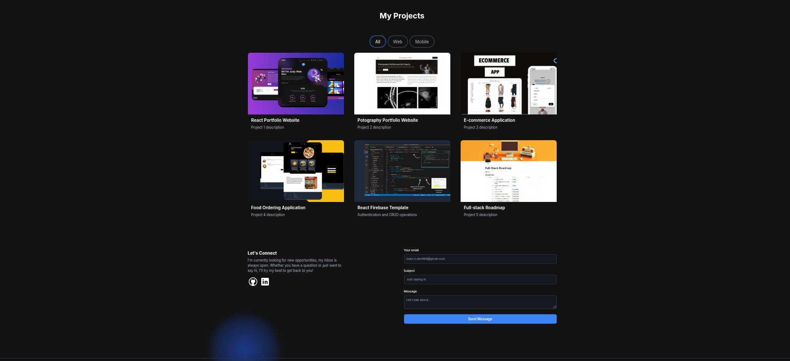

# 🌐 Portfolio Website

A modern, responsive **portfolio website** built with **Next.js 13** and **Tailwind CSS**, designed to showcase projects, skills, and experiences in a clean and interactive way.

---

## 🚀 Features

- **Landing Page** with smooth animations (Framer Motion)  
- **About Me Section** with animated stats (react-animated-numbers)  
- **Projects Showcase** with detailed cards and descriptions  
- **Contact Form** powered by **Resend** for sending emails  
- **Responsive Design** for desktop, tablet, and mobile  
- **Modern UI/UX** with Tailwind CSS and HeroIcons  
- **Animations & Typing Effects** using react-type-animation  

---

## 🛠 Tech Stack

- **Frontend:** Next.js 13 (App Router), React 18, Tailwind CSS, HeroIcons  
- **Animations & UI:** Framer Motion, React Animated Numbers, React Type Animation  
- **Email Integration:** Resend  
- **Tooling & Workflow:** ESLint, PostCSS, Autoprefixer, Git  

---

## 📸 Screenshots

> Place your screenshots inside a `screenshots/` folder and update the paths below.  

### 🏠 Home Page




---

## ⚡ Getting Started

Clone the repository and install dependencies:

```bash
git clone https://github.com/your-username/portfolio-website.git
cd portfolio-website
npm install

